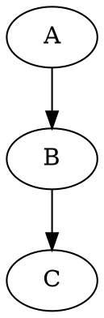

# DOT Renderer 浏览器插件

一个将网页中的DOT图形描述语言代码渲染为SVG或PNG图形的浏览器扩展。

## 功能特点

- 自动检测并渲染页面中的DOT代码
- 支持多种DOT代码标记方式（pre.dot, ```dot等）
- 支持纯文本形式的```dot代码块（不需要特殊的HTML标签）
- 支持在同一个元素中包含多个```dot代码块
- 智能验证代码内容是否符合DOT语法，避免误渲染
- 使用最新版Viz.js库进行高质量渲染
- 提供源代码与渲染图形的切换功能
- 支持图形放大查看功能
- 支持下载SVG或PNG格式的图形
- **[新增] 支持配置默认渲染格式**（SVG或PNG）
- **[新增] 支持直接在页面上切换渲染格式**
- **[新增] 现代化配置界面**，直观易用
- 支持中文标签和属性
- 美观的图形样式与交互效果
- 可手动触发渲染

## 安装方法

### 下载Viz.js库

在安装之前，您需要先下载最新版的Viz.js库文件：

1. 从 [Viz.js GitHub Releases](https://github.com/mdaines/viz.js/releases) 下载最新版的viz-standalone.js
2. 或者从CDN获取：https://unpkg.com/@viz-js/viz@3.2.4/lib/viz-standalone.js
3. 将下载的文件放置在 `lib/viz-standalone.js` 位置

### Chrome浏览器

1. 下载或克隆此存储库到本地
2. 确保已正确放置Viz.js库文件
3. 打开Chrome浏览器，进入扩展程序页面 (chrome://extensions/)
4. 开启"开发者模式"（右上角开关）
5. 点击"加载已解压的扩展程序"按钮
6. 选择本项目的文件夹

### Firefox浏览器

1. 下载或克隆此存储库到本地
2. 确保已正确放置Viz.js库文件
3. 打开Firefox浏览器，进入附加组件页面 (about:addons)
4. 点击齿轮图标，选择"调试附加组件"
5. 点击"临时载入附加组件..."
6. 选择项目中的manifest.json文件

## 插件界面与使用方法

### 插件界面

插件提供了直观、现代化的用户界面，包含以下几个主要部分：

#### 状态区域
显示插件当前的运行状态，包括是否已启用以及渲染引擎是否正常工作。

#### 渲染设置
提供格式选择选项，可以在SVG和PNG两种格式之间选择：
- **SVG格式**：矢量图形格式，可无损缩放，适合需要后期编辑的场景
- **PNG格式**：位图格式，具有更好的兼容性，适合直接使用或分享

#### 操作区域
包含"手动渲染"按钮，可以强制重新扫描并渲染当前页面中的所有DOT代码。

#### 使用说明
简要的使用提示，帮助用户了解如何在页面中添加DOT代码以及如何使用格式切换功能。

### 配置功能

插件提供了可配置的选项，允许用户自定义渲染行为：

1. 点击浏览器工具栏中的插件图标，打开配置面板
2. 在渲染设置区域中，选择默认渲染格式：
   - **SVG格式**：矢量格式，质量更高，适合后续编辑（默认）
   - **PNG格式**：位图格式，兼容性更好，适合直接使用
3. 点击"应用设置"按钮保存配置

所有配置将自动保存，并应用于当前和未来的渲染过程。

此外，您也可以在网页上通过图形控制面板的SVG/PNG按钮直接切换格式：
- 点击**SVG**按钮：切换到矢量格式显示
- 点击**PNG**按钮：切换到位图格式显示

页面上的格式切换会自动保存为默认设置，以便后续页面使用。

### 添加DOT代码

安装插件后，插件会自动检测页面中的DOT代码并渲染。DOT代码可以用以下三种方式编写：

```html
<!-- 方法1：使用pre标签和dot类 -->
<pre class="dot">
digraph G {
  A -> B;
  B -> C;
}
</pre>

<!-- 方法2：使用带有language-dot类的code标签（通常由Markdown渲染器生成） -->
<code class="language-dot">
digraph G {
  A -> B;
  B -> C;
}
</code>
```

在Markdown中或纯文本中，可以直接使用以下格式（无需特殊HTML标签）：

```


您还可以在同一个HTML元素中包含多个```dot代码块，它们都会被正确渲染：

```html
<div>
  第一个图：
  ```dot
  digraph G1 {
    A -> B -> C;
  }
  ```
  
  第二个图：
  ```dot
  digraph G2 {
    D -> E -> F;
  }
  ```
</div>
```

### 页面交互功能

每个渲染的图形都提供以下交互功能：

- **查看源代码**：点击"查看源代码"按钮可以切换显示原始DOT代码和渲染图形
- **放大**：点击"放大"按钮可在弹出层中查看更大尺寸的图形，点击弹出层背景或按ESC键可关闭
- **下载**：点击"下载"按钮可下载当前显示格式的图形
- **SVG**：点击"SVG"按钮可切换到SVG格式显示（矢量格式）
- **PNG**：点击"PNG"按钮可切换到PNG格式显示（位图格式）

当切换显示格式时，系统会自动更新默认渲染格式配置，后续渲染将使用新选择的格式。

## 项目结构

```
dot-renderer/
├── manifest.json      # 插件配置文件
├── popup.html         # 插件弹出窗口
├── popup.css          # 弹出窗口样式
├── popup.js           # 弹出窗口脚本（包含配置管理）
├── content.js         # 内容脚本（处理页面渲染）
├── styles.css         # 内容样式
├── lib/               # 第三方库
│   └── viz-standalone.js # Viz.js (Graphviz的JavaScript实现)
├── images/            # 插件图标
│   ├── icon16.png
│   ├── icon48.png
│   └── icon128.png
├── test.html          # 测试页面
├── test-multi.html    # 多DOT代码块测试页面
└── test-validation.html # DOT代码验证测试页面
```

## 关于Viz.js库

本插件使用最新版的Viz.js库来渲染DOT代码。新版Viz.js使用Promise-based API进行渲染：

```javascript
// 初始化Viz实例
Viz.instance().then(function(viz) {
  // 渲染DOT代码为SVG元素
  viz.renderSVGElement("digraph { a -> b }").then(function(svgElement) {
    // 将SVG元素添加到页面
    document.getElementById("graph").appendChild(svgElement);
  });
});
```

## 注意事项

- 本插件依赖于最新版的Viz.js库进行DOT代码渲染
- 支持三种方式的DOT代码：pre标签、code标签和纯文本形式的```dot代码块
- 插件会智能验证代码内容是否符合DOT语法，只渲染有效的DOT代码
- 支持在同一个元素中包含多个```dot代码块，每个都会被分别渲染
- 对于无效的DOT代码（不符合语法要求），将保持原样不进行渲染
- 渲染大型或复杂图形可能需要一定时间，会显示加载指示器
- 如遇渲染错误，会显示错误信息
- 可通过插件配置或页面上的SVG/PNG按钮选择默认渲染格式
- 切换渲染格式会自动更新默认配置
- PNG格式渲染在复杂图形时可能需要更多处理时间
- PNG导出功能在某些安全限制严格的环境下可能不可用，此时建议使用SVG格式
- 可通过点击插件图标，手动触发页面重新渲染

## 许可证

MIT